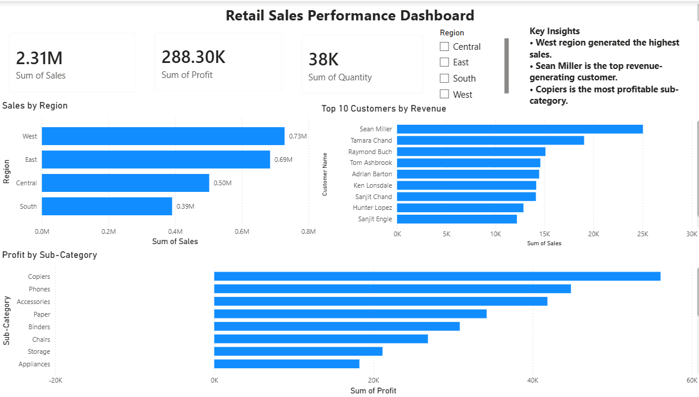

# Retail Sales Performance Dashboard 
## Dashboard Preview

## Project Overview

This project analyzes retail sales data using Excel, SQL, and Power BI.

## Tools Used

* Excel (Data Cleaning)
* SQL (Data Analysis)
* Power BI (Dashboard Creation)

## Dashboard KPIs

* Total Sales: 2.31M
* Total Profit: 288.30K
* Total Quantity Sold: 38K

## Key Insights

* West region generated the highest sales.
* Sean Miller is the top revenue-generating customer.
* Copiers is the most profitable sub-category.

## Files Included

* Retail_Sales_Performance_Dashboard.pbix
* Retail_Sales_SQL_Queries.sql
* dashboard.png

## Skills Demonstrated

* Data Cleaning
* SQL Queries
* KPI Analysis
* Dashboard Design
* Business Insights
